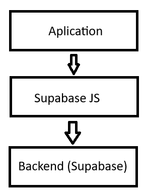

# prueba-tecnica

## To test the code:

```
 https://github.com/EstebanAF/prueba-tecnica-vue.git
 cd prueba-tecnica-vue
 npm install
 npm run serve
```
## So now in http://localhost:8081/ u can find the web

### user1
```
    User: admin@admin.com
    pass: admin123
```
### user2
```
    User: admin2@admin.com
    pass: admin123
```

## Architecture
#### This app is based on a layered architecture since it's simple code. So, three layers were defined:

#### 1. Application layer (which includes all view components like views and components).
#### 2.Supabase folder, which is the library enabling communication between the application layer (layer 1) and the backend, which constitutes the third layer, with Supabase service.
#### 3. Backend Supabase 
